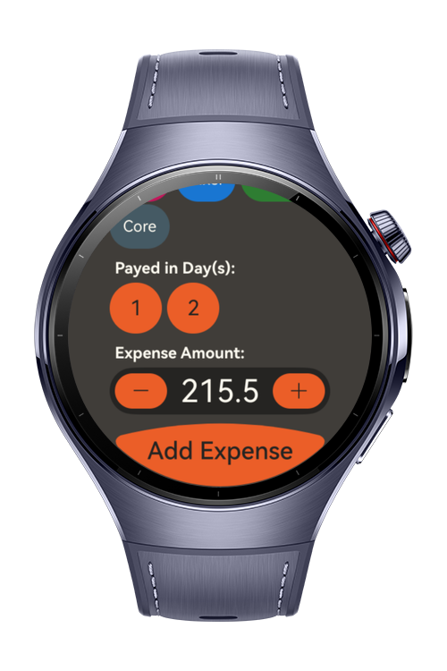
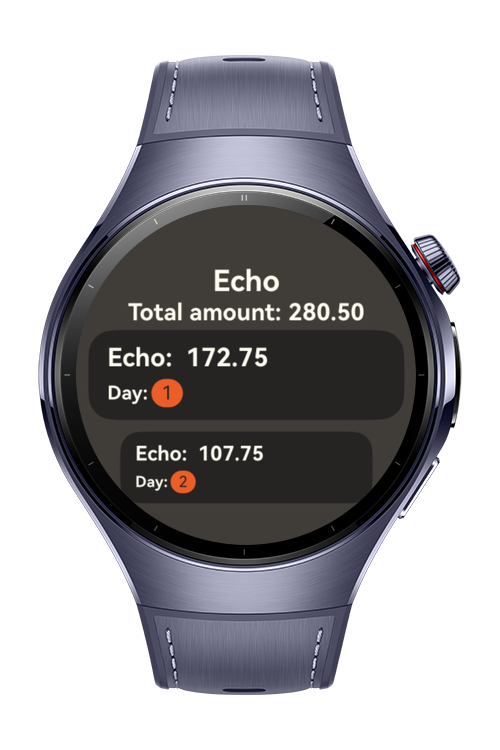

> **Note:** To access all shared projects, get information about environment setup, and view other guides, please visit [Explore-In-HMOS-Wearable Index](https://github.com/Explore-In-HMOS-Wearable/hmos-index).

# Expense Splitter

**Expense Splitter** is a sample HarmonyOS app that makes it easy to record shared expenses.
Using predefined participant labels and a simple number pad, you can quickly add payments and see how much each person
has contributed.

# Preview

<div>
  
  
  
  
</div>

# Use Cases

- **Trip Tracking:** Start a trip (e.g., Weekend, Dinner, Taxi) and add participants with predefined labels.
- **Quick Expense Entry:** Record payments with a simple number pad and assign them to a payer.
- **Daily Overview:** See on which days expenses were made during the trip.
- **Contribution Summary:** View how much each participant has paid in total.
- **Sample Learning Project:** Explore ArkTS + RDB data persistence, UI design for wearables, and expense aggregation
  logic.

# Technology

## Stack

- **Languages**: ArkTS, Typescript
- **Frameworks**: HarmonyOS SDK 5.1.0(18)
- **Tools**: DevEco Studio Version 5.1.0.828
- **Libraries**:
    - `@kit.ArkUI`
    - `@kit.AbilityKit`
    - `@kit.PerformanceAnalysisKit`
    - `@kit.BasicServicesKit`
    - `@kit.ArkData`

## Persisting RDB Store Data (ArkData)

This project uses **relational database (RDB) store** (@kit.ArkData) with migrations, CRUD, and predicates for managing
expenses.

- **Migrations** – Stepwise upgrades (0→1→2→3) with PRAGMA user_version, run inside transactions.
- **Inserting** – Adds expenses and splits amounts into exact cents.
- **Deleting** – Cascade deletes (removing a trip also removes participants and expenses).
- **Updating** – Simple updates (e.g., amounts); complex edits handled by re-adding rows.
- **Predicates** – RdbPredicates and querySql used for filters, joins, and aggregations (e.g., SUM per payer).

Example files:

- `src/main/ets/database/RDBBuilder.ets` – RDB builder, builds the database + handles migrations + initial RDB creation
- `src/main/ets/database/AppDatabase.ets` – CRUD, managing trips and payers functions
- `src/main/ets/database/migrations/Migrations.ets` – Migrations
- `src/main/ets/database/tables/` – RDB Tables, creation queries + table columns

## Dependency Injection (Registry-Based)

This project includes a lightweight, custom **Dependency Injection (DI)** system, implemented with decorators and a
central service registry.

- Services are registered in `MainRegistry.ets` using `@Register()` decorators
- Classes can `@Resolve()` dependencies without manually wiring them
- Lazy and singleton services are supported via internal `ServiceRegistry.ts`

Example files:

- `src/main/ets/di/MainRegistry.ets` – Application-level service registration uses `@Register` to register a service.
- `src/main/ets/registry/Injectable.ts` – `Injectable` Interface, used to mark any class that will be injected later.
- `src/main/ets/registry/ServiceRegistry.ts` – Core service container, also has `@Register`, `@Resolve` decorators.

This allows separation of concerns and improved testability for components like:

- `AppDatabase` with it's implementation class `AppDatabaseImpl`
- ViewModels and utilities

# Project Directory

```
├── entry/src/main/ets/
│   ├──components/                      // Reusable UI components
│   ├──constants/                       // Constants like sizes
│   ├──database/
│   │  ├──migrations/             
│   │  │  ├──Migrations.ets             // Migration steps (0→1, 1→2, …) with RDB query changes
│   │  │  └──RDBMigration.ets           // Migration class definition (from, to) version, with run query method.
│   │  ├──tables/                        
│   │  │  ├──ExpensesTable.ets          // Expense table schema, indexes and columns
│   │  │  ├──RDBTable.ets               // Common table interface for create + indexes + columns
│   │  │  └──TripTable.ets              // Trip table schema, indexes and columns
│   │  ├──AppDatabase.ets               // Database abstraction (methods for CRUD + queries)
│   │  ├──AppDatabaseImpl.ets           // Implementation of AppDatabase using RDB APIs
│   │  └──RDBBuilder.ets                // Builder utility to open DB, apply migrations, build tables
│   ├──di/                              // DI container and main registry
│   ├──entryability/
│   │  └──EntryAbility.ets              // Main entry point ability
│   ├──entrybackupability/
│   │  └──EntryBackupAbility.ets        // Backup entry ability
│   ├──model/                           // Data models (Expense, Trip, TripExpenses)
│   ├──myabilitystage/
│   │  └──MyAbilityStage.ets            // Custom AbilityStage for config setup
│   ├──pages/
│   │  ├──AddExpensePage.ets            // UI for creating a new expense
│   │  ├──AddTripPage.ets               // UI for creating a new trip
│   │  ├──ExpensesPage.ets              // UI showing all expenses for a trip
│   │  ├──Index.ets                     // App start page / navigation root
│   │  ├──PayerExpensesPage.ets         // UI showing expenses filtered by payer
│   │  └──TripsPage.ets                 // UI listing all trips
│   ├──registry/                        // Decorators and DI service registry
│   ├──utils/
│   │  └──Logger.ets                    // Logging utility
│   └──viewmodel/
│      ├──datasource/                   // Data sources feeding ViewModels with prepared arrays (refresh, delete, add) data
│      ├──AddExpenseViewModel.ets       // Handles state & logic for adding a new expense
│      ├──AddTripViewModel.ets          // Manages trip creation flow
│      ├──ExpensesViewModel.ets         // Provides expenses list and summaries for a trip
│      ├──PayerExpensesViewModel.ets    // Exposes expenses filtered by a specific payer
│      └──TripsViewModel.ets            // Handles trips list
```

# Constraints and Restrictions

## Supported Devices

- Huawei Watch 5

# LICENSE

**Expense Splitter** is distributed under the terms of the MIT License.
See the [license](/LICENSE) for more information.